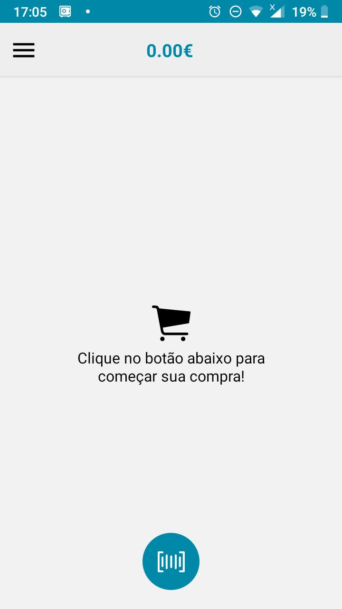

# MarketApp
App em react-native para escanear os produtos da loja, poupar tempo no caixa e diminuir as filas
----
## prints

## objetivos

- [x] cards dos produtos bipados
    - [x] aumentar e diminuir a quantidade do produto
    - [x] selecionar e apagar produtos
    - [x] calcular o preço conforme a quantidade aumenta ou diminui
    - [x] clicar e ir para uma tela com informações do produto
- [x] tela de scanear o codigo de barras
    - [x] scanear o código
    - [x] mandar codigo para tela anterior para procurar o item no servidor
    - [x] opção para digitar o numero do código manualmente
- [x] procurar o item bipado no servidor/json local
- [x] adicionar o item encontrado na lista de produtos
- [x] finalizar compra
    - [x] enviar lista com os produtos bipados para o json
    - [x] gerar um codigo de barras com o endereço desta lista
    - [x] se a finalização da comprar for cancelada, apagar a lista do json
- [ ] LOGIN E LOGOUT
    - [x] Instalar firebase login como api de login
    - [x] login com Telefone
    - [ ] login com email e senha
    - [ ] login com google
    - [ ] login com facebook
- [ ] detalhes para add
    - [x] validar login
    - [x] validar confirmLogin
    - [ ] validar logout
    - [x] alerta de loading login
    - [x] alerta de loading confirmLogin
    - [ ] alerta de loading logout
    - [x] alerta de loading procurar produto
    - [x] alerta de loading finalizar compra
    - [ ] imagens nos slides de intro
    - [ ] tutorial no app

## Versões adaptadas do app para criar aos seguintes bancos de dados 
- [ ] mySQL
- [ ] Node
- [ ] firebase
